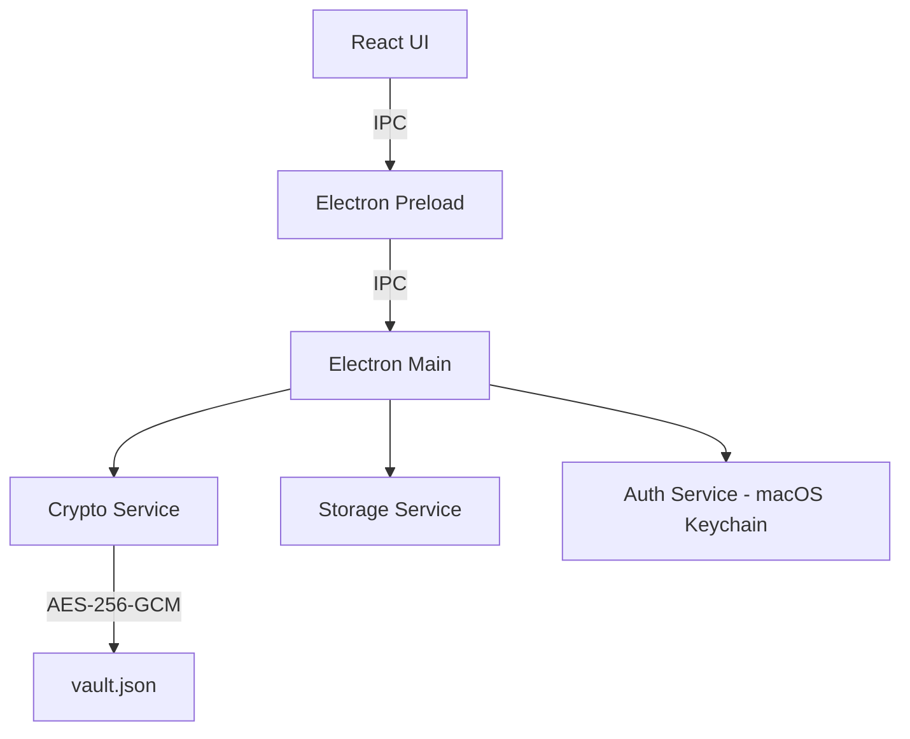

# Personal Vault (JS/Electron)

Personal Vault, hız ve gizlilik odaklı, yerel çalışan bir şifre yönetim uygulamasıdır. Verilerinizi AES-256-GCM standartlarında şifreleyerek yerel diskte (`vault.json`) saklar ve macOS ekosistemiyle tam entegre çalışır.

## 🚀 Öne Çıkan Özellikler

### ✨ Yeni in v1.1.2

- **📱 Android Desteği**: Tam fonksiyonel mobil uygulama (APK) ve yerel senkronizasyon.
- **⏳ Şifre Geçerlilik Süresi**: Kayıtlara 1-24 ay arası süre belirleme. Süresi dolan kayıtlar **kırmızı** ile işaretlenir.
- **✏️ Kayıt Yönetimi**: Mevcut kayıtları düzenleme (isim, şifre) ve silme özellikleri eklendi.
- **🗑️ Çöp Kutusu**: Gereksiz kayıtları güvenle tek tıkla silin.
- **🎨 Gelişmiş UI**: Mobilde dropdown ve butonlar için daha ergonomik ve dokunmatik dostu tasarım.

- **🔒 Master Password Güvenliği**: Kasanız, sizin belirlediğiniz bir ana şifre ile korunur.
- **🍎 macOS Entegrasyonu**: Kasa anahtarı macOS Anahtar Zinciri'nde (Keychain) saklanır. Touch ID veya sistem şifresiyle hızlı giriş imkanı sunar.
- **🔄 Yerel Ağ Senkronizasyonu**: Aynı WiFi ağındaki cihazlarınız arasında manuel senkronizasyon. Verileriniz internete çıkmaz.
- **✨ Premium Arayüz**: Glassmorphism tasarımı, akıcı animasyonlar ve modern bir kullanıcı deneyimi.
- **⚡ Akıllı Kopyalama**: Tek tıklama ile kullanıcı adı veya şifreyi panoya kopyalar.
- **🧹 Pano Temizliği**: Hassas veriler kopyalandıktan 30 saniye sonra pano otomatik olarak temizlenir.
- **🔍 Anlık Arama**: Kayıtlarınız arasında başlık veya kullanıcı adına göre anlık filtreleme.

## 🛠️ Teknik Mimari

Uygulama, Electron ve React kullanılarak geliştirilmiştir. Güvenlik katmanı Node.js `crypto` modülü üzerine inşa edilmiştir.

### Komponent Diyagramı



## 📦 Kurulum ve Çalıştırma

### Gereksinimler

- [Node.js](https://nodejs.org/) (v18+)
- [npm](https://www.npmjs.com/)

### Adımlar

1. Projeyi klonlayın veya indirin.
2. Bağımlılıkları yükleyin:

   ```bash
   npm install
   ```

3. Geliştirme modunda çalıştırın:

   ```bash
   npm run dev
   ```

## 🔨 Paketleme

Uygulamayı bir masaüstü uygulaması (.app) olarak paketlemek için:

```bash
npm run electron:build
```

Bu komut, Vite ile frontend build'ini alır ve `electron-builder` kullanarak `dist` klasörü altında yüklenebilir dosyayı oluşturur.

## 🔄 Yerel Ağ Senkronizasyonu

Aynı WiFi ağındaki cihazlarınız arasında kasanızı senkronize edebilirsiniz.

### Sync Host Başlatma

```bash
cd sync-host
chmod +x start.sh
./start.sh
```

İlk çalıştırmada otomatik olarak:

- Bağımlılıklar yüklenir
- Rastgele bir auth token oluşturulur
- `.env` dosyası oluşturulur

### Kullanım

1. Uygulamada sağ üstteki 🔄 butonuna tıklayın
2. "Discover Host" ile sync server'ı otomatik bulun
3. "Pull from Host" ile kasayı indirin
4. "Push to Host" ile kasayı yükleyin

Detaylı bilgi için: [`sync-host/README.md`](sync-host/README.md)

## 🛡️ Güvenlik Notları

- **Encryption**: AES-256-GCM (İnitalize Vector ve Auth Tag kullanımıyla).
- **Key Derivation**: PBKDF2-SHA512 (100.000 iterasyon).
- **Local-First**: Verileriniz asla dış bir sunucuya gitmez, sadece yerel cihazınızda saklanır.

## 📄 Lisans

Bu proje kişisel kullanım için geliştirilmiştir.
