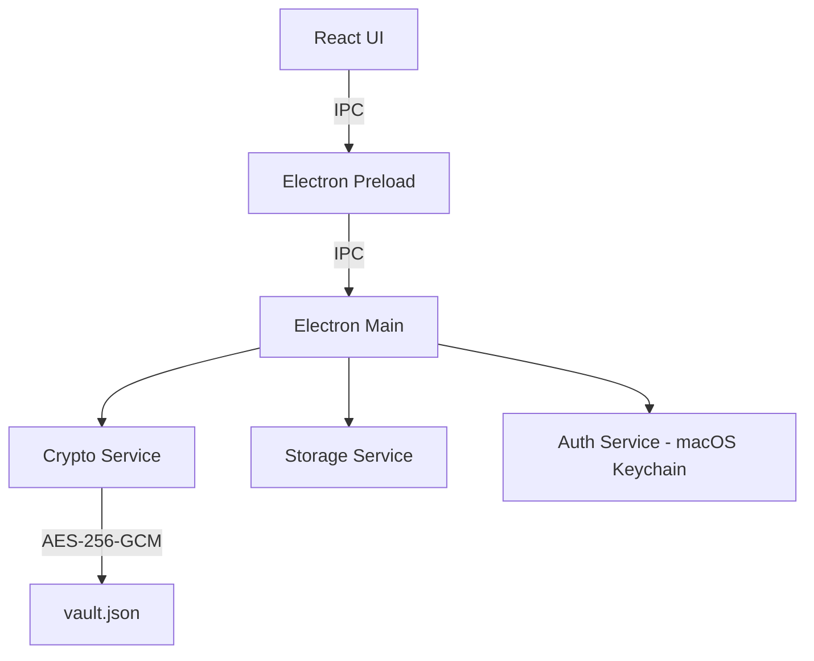

# Personal Vault (JS/Electron)

Personal Vault, hız ve gizlilik odaklı, yerel çalışan bir şifre yönetim uygulamasıdır. Verilerinizi AES-256-GCM standartlarında şifreleyerek yerel diskte (`vault.json`) saklar ve macOS ekosistemiyle tam entegre çalışır.

## 🚀 Öne Çıkan Özellikler

- **🔒 Master Password Güvenliği**: Kasanız, sizin belirlediğiniz bir ana şifre ile korunur.
- **🍎 macOS Entegrasyonu**: Kasa anahtarı macOS Anahtar Zinciri'nde (Keychain) saklanır. Touch ID veya sistem şifresiyle hızlı giriş imkanı sunar.
- **✨ Premium Arayüz**: Glassmorphism tasarımı, akıcı animasyonlar ve modern bir kullanıcı deneyimi.
- **⚡ Akıllı Kopyalama**: Tek tıklama ile kullanıcı adı veya şifreyi panoya kopyalar.
- **🧹 Pano Temizliği**: Hassas veriler kopyalandıktan 30 saniye sonra pano otomatik olarak temizlenir.
- **🔍 Anlık Arama**: Kayıtlarınız arasında başlık veya kullanıcı adına göre anlık filtreleme.

## 🛠️ Teknik Mimari

Uygulama, Electron ve React kullanılarak geliştirilmiştir. Güvenlik katmanı Node.js `crypto` modülü üzerine inşa edilmiştir.

### Komponent Diyagramı


## 📦 Kurulum ve Çalıştırma

### Gereksinimler
- [Node.js](https://nodejs.org/) (v18+)
- [npm](https://www.npmjs.com/)

### Adımlar
1. Projeyi klonlayın veya indirin.
2. Bağımlılıkları yükleyin:
   ```bash
   npm install
   ```
3. Geliştirme modunda çalıştırın:
   ```bash
   npm run dev
   ```

## 🔨 Paketleme

Uygulamayı bir masaüstü uygulaması (.app) olarak paketlemek için:

```bash
npm run electron:build
```
Bu komut, Vite ile frontend build'ini alır ve `electron-builder` kullanarak `dist` klasörü altında yüklenebilir dosyayı oluşturur.

## 🛡️ Güvenlik Notları

- **Encryption**: AES-256-GCM (İnitalize Vector ve Auth Tag kullanımıyla).
- **Key Derivation**: PBKDF2-SHA512 (100.000 iterasyon).
- **Local-First**: Verileriniz asla dış bir sunucuya gitmez, sadece yerel cihazınızda saklanır.

## 📄 Lisans
Bu proje kişisel kullanım için geliştirilmiştir.
